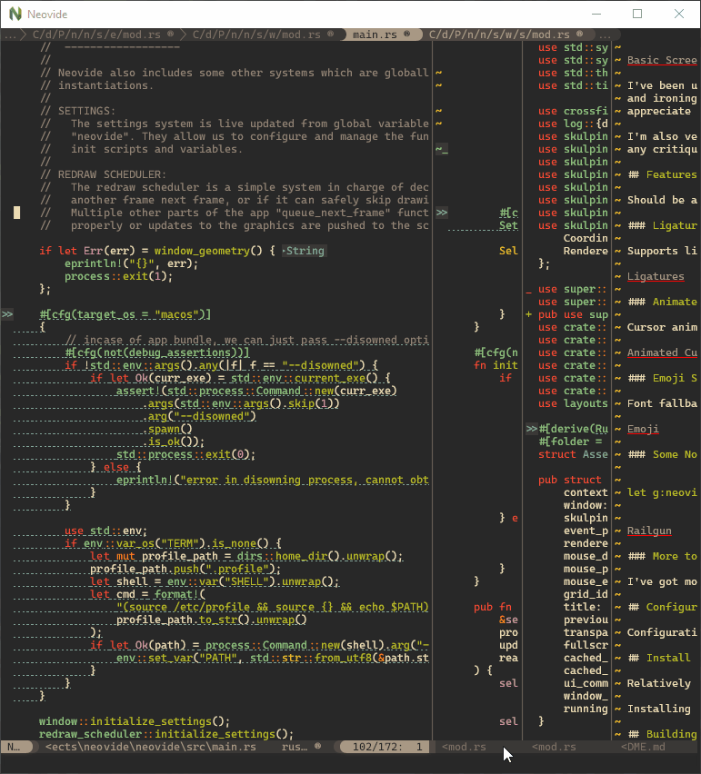
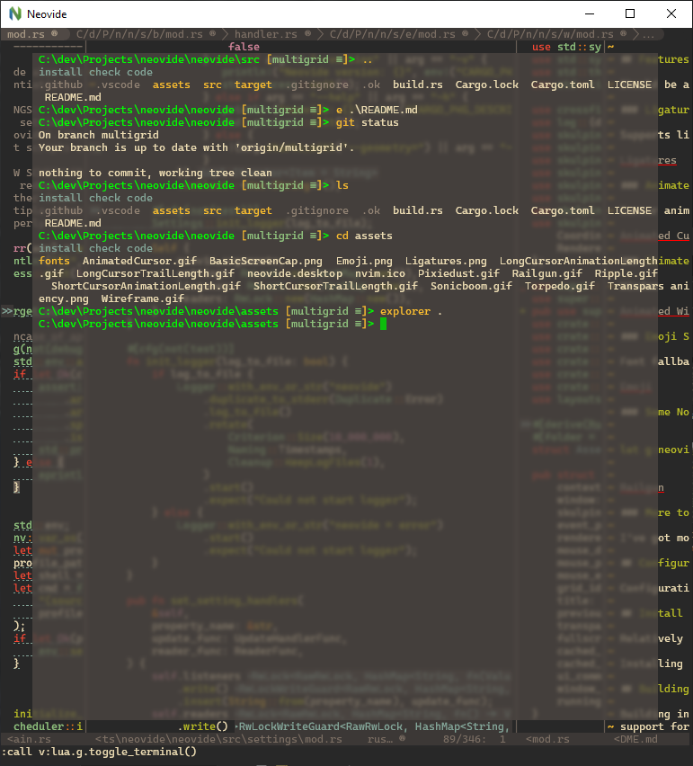
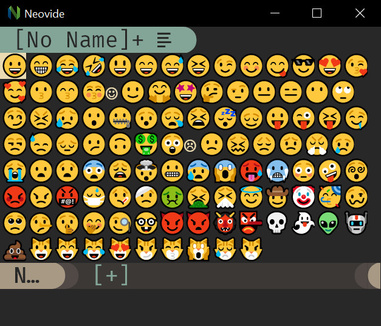

# Neovide [](https://gitter.im/neovide/community?utm_source=badge&utm_medium=badge&utm_campaign=pr-badge) [](https://github.com/Kethku/neovide/discussions)

This is a simple graphical user interface for Neovim. Where possible there are some graphical improvements, but it should act
functionally like the terminal UI.


I've been using this as my daily driver since November 2019. It should be relatively stable, but I'm still working out some kinks
and ironing out some cross platform issues. In general it should be usable at this point, and if it isn't I consider that a bug and
appreciate a report in the issues! Any help and ideas are also greatly appreciated.

I'm also very interested in suggestions code quality/style wise when it comes to Rust. I'm pretty new to the language and appreciate
any critiques that you might have to offer. I won't take all of them, but I promise to consider anything you might have to offer.

 [](https://ko-fi.com/G2G040CA8)

## Features

Should be a standard full features Neovim GUI. Beyond that there are some visual niceties:

### Ligatures

Supports ligatures and full [HarfBuzz](https://www.freedesktop.org/wiki/Software/HarfBuzz/) backed font shaping.


### Animated Cursor

Cursor animates into position with a smear effect to improve tracking of cursor position.


### Smooth Scrolling

Scroll operations on buffers in neovim will be animated smoothly pixel wise rather than line by line at a time. Note, multigrid must be
enabled for this to work.
https://github.com/Kethku/neovide/wiki/Configuration#multiGrid


### Animated Windows

Windows animate into position when they are moved making it easier to see how layout changes happen. Note, multigrid must be enabled for
this to work.
https://github.com/Kethku/neovide/wiki/Configuration#multiGrid



### Blurred Floating Windows

The backgrounds of floating windows are blurred improving the visual separation between foreground and background from
built in window transparency. Note, multigrid must be enabled for this to work.
https://github.com/Kethku/neovide/wiki/Configuration#multiGrid



### Emoji Support

Font fallback supports rendering of emoji not contained in the configured font.



### WSL Support

Neovide supports displaying a full gui window from inside wsl via the `--wsl` command argument. Communication is passed via standard io into the wsl copy of neovim providing identical experience similar to visual studio code's remote editing https://code.visualstudio.com/docs/remote/remote-overview.

### Remote TCP Support

Neovide supports connecting to a remote instance of Neovim over a TCP socket via the `--remote-tcp` command argument. This would allow you to run Neovim on a remote machine and use the GUI on your local machine, connecting over the network.

Launch Neovim as a TCP server (on port 6666) by running:

```sh
nvim --headless --listen localhost:6666
```

And then connect to it using:

```sh
/path/to/neovide --remote-tcp=localhost:6666
```

By specifying to listen on localhost, you only allow connections from your local computer. If you are actually doing this over a network you will want to use SSH port forwarding for security, and then connect as before.

```sh
ssh -L 6666:localhost:6666 ip.of.other.machine nvim --headless --listen localhost:6666
```

### Some Nonsense ;)

```vim
let g:neovide_cursor_vfx_mode = "railgun"
```


### More to Come

I've got more ideas for simple unobtrusive improvements. More to come.

## Configuration

Configuration is done almost completely via global neovide variables in your vim config and can be manipulated live at runtime. Details can be found [here](https://github.com/Kethku/neovide/wiki/Configuration).

## Install

**Note**: Building instructions are somewhat limited at the moment. All the libraries I use are cross platform and should have
support for Windows, Mac, and Linux. The rendering however is Vulkan-based, so driver support for Vulkan will be
necessary. On Windows this should be enabled by default if you have a relatively recent system.

**Note**: Neovide requires neovim version 0.4 or greater.

### From binary

Relatively recent binaries can be found in the [project releases](https://github.com/Kethku/neovide/releases). But if you want the latest and greatest you should clone it and build yourself.

Installing should be as simple as downloading the binary, making sure `nvim.exe` with version 0.4 or greater is on your path, and running it. Everything should be self contained.

### Windows

#### Package manager

[Scoop](https://scoop.sh/) has Neovide in the `extras` bucket. Ensure you have the `extras` bucket, and install:

```
$ scoop bucket list
main
extras

$ scoop install neovide
```

#### From source

1. Install the latest version of Rust. I recommend <https://rustup.rs/>
2. Install CMake. I use chocolatey: `choco install cmake --installargs '"ADD_CMAKE_TO_PATH=System"' -y`
3. Install LLVM. I use chocolatey: `choco install llvm -y`
4. Ensure graphics libraries are up to date.
5. Build and install Neovide:

    ```sh
    git clone https://github.com/Kethku/neovide
    cd neovide
    cargo build --release
    ```

6. Copy `./target/release/neovide.exe` to a known location and enjoy.

### Mac (from source)

1. Install the latest version of Rust. I recommend <https://rustup.rs/>
2. Install CMake. Using homebrew: `brew install cmake`
3. Install the Vulkan SDK. I'm told `brew install apenngrace/vulkan/vulkan-sdk` works, but I can't test locally to find out.
4. Build and install Neovide:

    ```sh
    git clone https://github.com/Kethku/neovide
    cd neovide
    cargo build --release
    ```

5. Copy `./target/release/neovide` to a known location and enjoy.

### Linux

#### Arch Linux

There is an [AUR package for neovide](https://aur.archlinux.org/packages/neovide-git/).

##### With Paru (or your preferred AUR helper)

```sh
paru -S neovide-git
```

##### Without helper

```sh
git clone https://aur.archlinux.org/neovide-git.git
cd neovide-git
makepkg -si
```

##### With non-default branch

```sh
git clone https://aur.archlinux.org/neovide-git.git
cd neovide-git
REGEX=$(printf 's/{url}/&\#branch=%s/g' '<YOUR-BRANCH-HERE>')
sed "$REGEX" PKGBUILD
makepkg -si
```

#### From source
1. Install necessary dependencies (adjust for your preferred package manager)

    ```sh
    sudo apt install -y curl \
        gnupg ca-certificates git \
        gcc-multilib g++-multilib cmake libssl-dev pkg-config \
        libfreetype6-dev libasound2-dev libexpat1-dev libxcb-composite0-dev \
        libbz2-dev libsndio-dev freeglut3-dev libxmu-dev libxi-dev
    ```

2. Install Vulkan SDK (adjust for your preferred package manager, may already be in your repository)

    ```sh
    curl -sL "http://packages.lunarg.com/lunarg-signing-key-pub.asc" | sudo apt-key add -
    sudo curl -sLo "/etc/apt/sources.list.d/lunarg-vulkan-1.2.131-bionic.list" "http://packages.lunarg.com/vulkan/1.2.131/lunarg-vulkan-1.2.131-bionic.list"
    sudo apt update -y
    sudo apt install -y vulkan-sdk
    ```

3. Install Rust

    ```sh
    curl --proto '=https' --tlsv1.2 -sSf "https://sh.rustup.rs" | sh
    ```

4. Clone the repository

    ```sh
    git clone "https://github.com/Kethku/neovide"
    ```

5. Build

    ```sh
    cd neovide && ~/.cargo/bin/cargo build --release
    ```

6. Copy `./target/release/neovide` to a known location and enjoy.

## Troubleshooting
- Neovide requires that a font be set in `init.vim` otherwise errors might be encountered. This can be fixed by adding `set guifont=Your\ Font\ Name:h15` in init.vim file. Reference issue [#527](https://github.com/Kethku/neovide/issues/527).
- On OSX, if you run into issues with the vulkan libraries being reported as not verified, please reference issue [#167](https://github.com/Kethku/neovide/issues/167#issuecomment-593314579).

### Linux-specific
- If you recieve an error of `SdlError("Installed Vulkan doesn't implement the VK_KHR_surface extension")`, please try installing the AMD Vulkan Driver (commonly, `amdvlk`). Reference issue [#209](https://github.com/Kethku/neovide/issues/209).
- If you recieve errors complaining about DRI3 settings, please reference issue [#44](https://github.com/Kethku/neovide/issues/44#issuecomment-578618052).
- If you recieve libsndio-related errors, try building without default features (this disables static linking of the SDL library).
