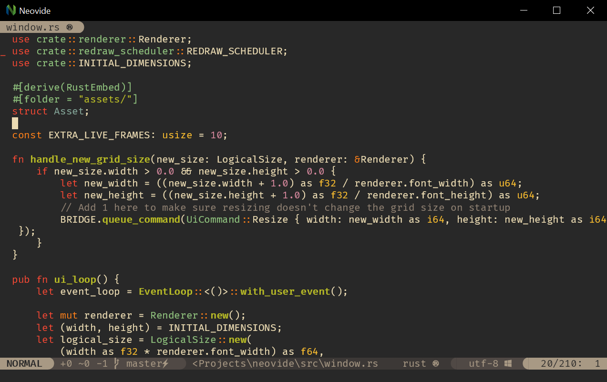
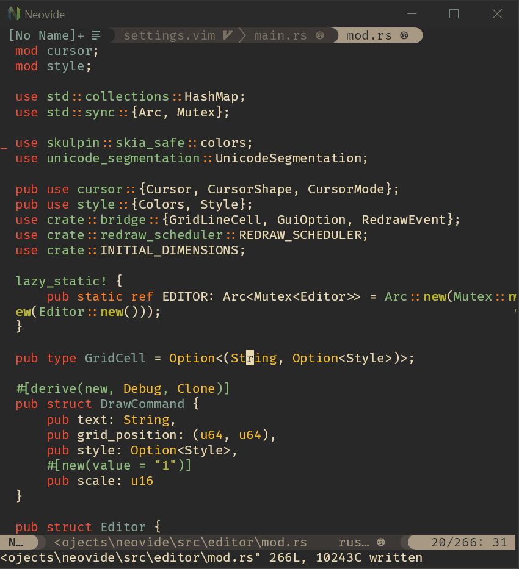

# Neovide
This is a simple graphical user interface for Neovim. Where possible there are some graphical improvements, but it should act
functionally like the terminal UI.

I've been using this as my daily driver since November 2019. It should be relatively stable, but I'm still working out some kinks and ironing out some cross platform issues. In general it should be usable at this point, and if it isn't I concider that a bug and appreciate a report in the issues! Any help and ideas are also greatly appreciated.

I'm also very interested in suggestions code quality/style wise when it comes to Rust. I'm pretty new to the language and appreciate any critiques that you might have to offer. I won't take all of them, but I promise to concider anything you might have to offer.

## Features
Should be a standard full features Neovim GUI. Beyond that there are some visual nicities:

### Ligatures

Supports ligatures and full Harbuzz backed font rendering.

### Animated Cursor

Cursor animates into position with a smear effect to improve tracking of cursor position.

### Emoji Support

Font fallback supports rendering of emoji not contained in the configured font.

#### More to Come

I've got more ideas for simple unobtrusive improvements. More to come.

## Install

Currently there is just a windows binary under the project releases https://github.com/Kethku/neovide/releases. I'm hoping to automate and produce mac and linux binaries as well, but I haven't gotten there yet.

Installing should be as simple as downloading the binary, making sure `nvim.exe` is on your path, and running it. Everything should be self contained.

## Building

Building instructions are somewhat limited at the moment. All the libraries I use are cross platform and should have
support for Windows Mac and Linux. The rendering however is Vulcan based, so driver support for vulcan will be
necessary. On Windows this should be enabled by default if you have a relatively recent system.

### Windows

1. Install latest version of rust. I recommend https://rustup.rs/
1. Ensure graphics libraries are up to date.
1. `git clone https://github.com/Kethku/neovide`
1. `cd neovide`
1. `cargo build --release`
1. Copy `./targets/release/neovide.exe` to a known location and enjoy.

### Mac

1. Install latest version of rust. I recommend https://rustup.rs/
1. Install vulcan sdk. I'm told `brew cask install apenngrace/vulkan/vulkan-sdk` works, but I can't test locally to find out.
1. `git clone https://github.com/Kethku/neovide`
1. `cd neovide`
1. `cargo build --release`
1. Copy `./targets/release/neovide` to a known location and enjoy.

### Linux (Probably Ubuntu, your millage may vary)

1. Important: `Neovide` has been successfully compiled also in other distros
1. Install latest version of rust. I recommend https://rustup.rs/
1. Install lib gtk. For example: `sudo apt install libgtk-3-dev`
1. Install `bzip2-devel` (or similar, depending on used distro)
1. Depending on which libraries are or not already installed in the system, additional libraries may need to be installed (no fear, we will do the possible to add them here)
1. If needed, install [vulkan-tools](https://github.com/LunarG/VulkanTools), etc. Informations available in the [vulkan](https://vulkan.lunarg.com/sdk/home) download page
1. Download the [Vulkan SDK for Linux](https://vulkan.lunarg.com/sdk/home) and extract it in an easily accessible folder
1. `git clone https://github.com/Kethku/neovide`
1. `cd neovide`
1. source /path/to//vulkansdk-linux-x86_64-1.1.130.0/1.1.130.0/setup-env.sh (version can change over time) in the shell that will be used to compile `Neovide`
1. `cargo build --release`
1. Copy `./targets/release/neovide` to a known location and enjoy.

If you see an error complaining about DRI3 settings, links in this issue may help. https://github.com/Kethku/neovide/issues/44#issuecomment-578618052

Note: Currently there seems to be problems with wayland https://github.com/aclysma/skulpin/issues/36. Any help would be appreciated.
